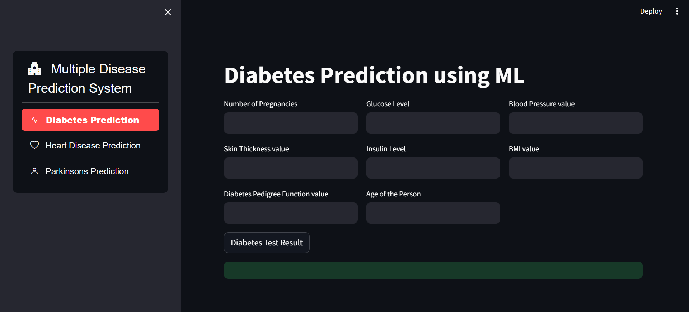
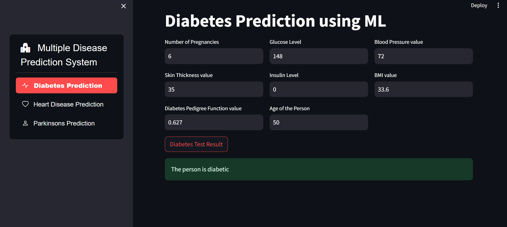
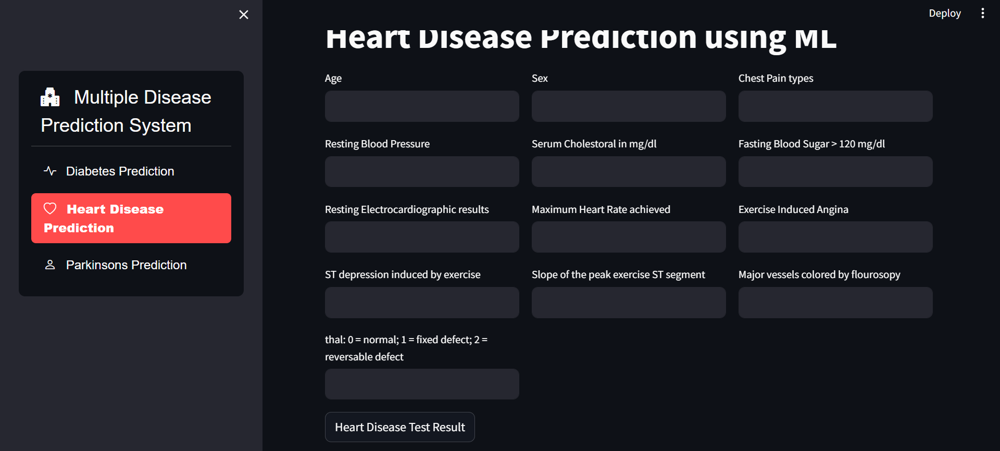
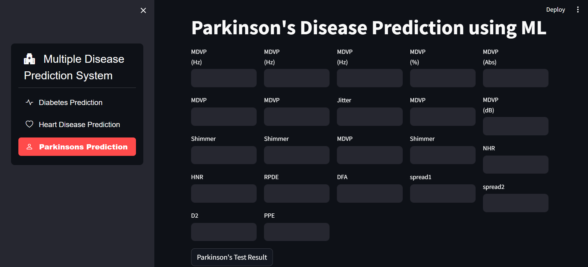

# MultidiseasePrediction

A machine learning application for predicting multiple diseases based on user input symptoms. Built using Python with libraries such as Scikit-Learn and Flask, and integrates with a web frontend.

## Features

- Predict multiple diseases based on user input symptoms
- User-friendly web interface for inputting symptoms and viewing results
- Backend integration with a machine learning model for predictions

## Technologies Used

- **Frontend**: HTML, CSS, JavaScript (Optional for frontend development)
- **Backend**: Scikit-Learn (for machine learning)
- **Machine Learning**: Scikit-Learn (model training and prediction)
- **Other**: Pandas, NumPy

## Screenshots

To provide a better understanding of the Recipe Book application, here is a screenshot:

##Diabete Interface

##Heart Interface

##Parkinson Interface

Feel free to customize this template according to your project's specific needs and details!

For any inquiries, please contact:

Name: Gauranshi Varshney
Email: gauranshivarshney@gmail.com
